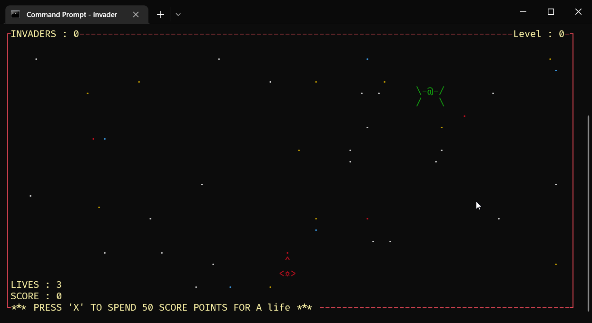

# ASCII-Invader
*" Protect our galaxy by destroying those alien invaders! "*  
My own variation of the classic [Space Invader](https://en.wikipedia.org/wiki/Space_Invaders) game.



## Platform
* Windows

## Running
You can download the latest release from [here](https://github.com/Kandeel4411/ASCII-Invader/releases) 

* How to play:
   - Run `invader.exe`
   - Press **A** or **D** to move left or right respectively  [ Only a tap should suffice ]
   - Press **Space** to shoot
   - Double tap **A** or **D** to move by a certain boost
   - Press **X** to gain a life by sacrificing a certain amount of score

There are 5 levels in the game. After the 2nd level, a boss
round should appear at the end of each level. (WARNING!) Boss bullets are undestroyable


## Building from source ( Visual Studio 2017 - 2019 )

### Dependencies
* PDCurses

### Building
* Clone the repo and create new project in Visual Studio
* Visual Studio 2017 [Source](https://stackoverflow.com/questions/42708392/install-pdcurses-on-visual-studio-2017?noredirect=1&lq=1)
    * Take the developer command prompt of VS2017 community edition and type in set `PDCURSES_SRCDIR=<PDCurses Directory Location>`; in my case it was

    ``` 
    set PDCURSES_SRCDIR=C:\pdcurses-master 
    ```

    * Navigate in the command window to the directory of PDcurses/wincon (in my case `C:\pdcurses-master\wincon`)

    * ` nmake –f Makefile.vc `
    (This is the make file for pd curses.) It will create the pdcurses.lib for our Visual Studio.

    * Now we need to incorporate the generated library into our project. So open up your project and go to project properties
      - In “VC++ Directories”, change:
        - Include directories: Add a new file-path to PDCurses installation directory, in my case it is `C:\pdcurses-master`.
        - Library directories: Add a new file-path to PDCurses installation library directory, in my case it is `C:\pdcurses-master\wincon`.

      - In C/C++:
        - In “Code Generation” tab, change “Runtime Library” to “Multithreaded Debug (/MTd)”. (Usually, it is set already)
      - In Linker:
        - In “Input” tab, add pdcurses.lib to Additional Dependencies (I initially got confused - remeber, it is the input tab of linker)
      - Click on Apply, and OK.
* Build and run project.
*Note: you might have to copy the assets folder to where your Visual Studio stores the compiled executable in order for the sounds to work* 

